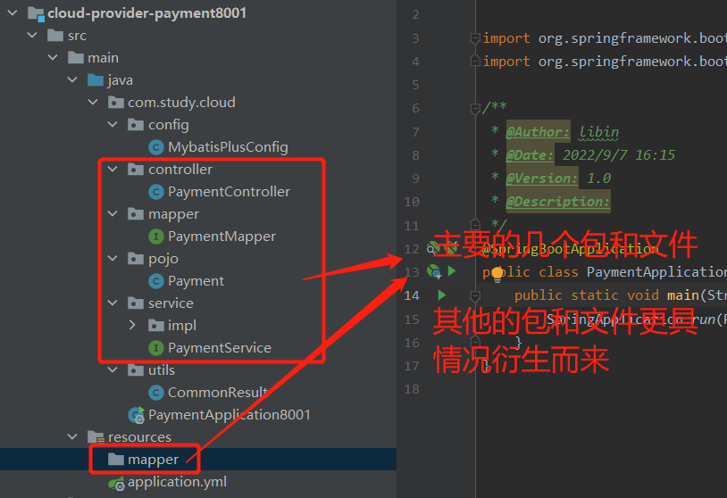
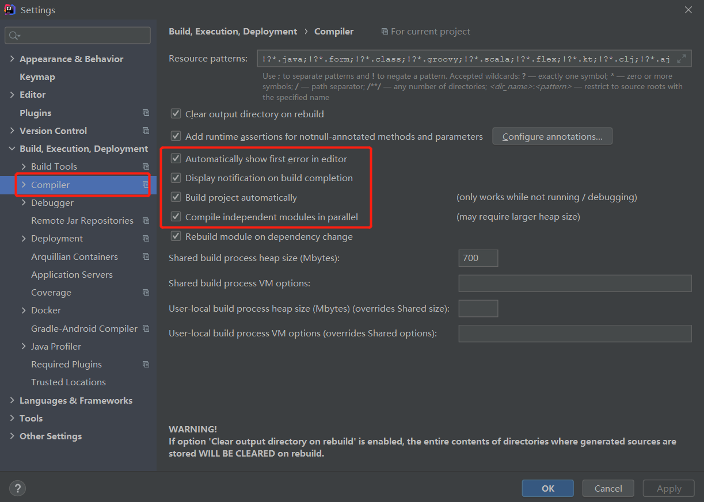
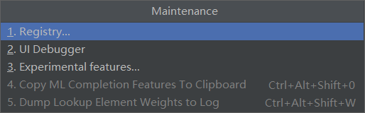
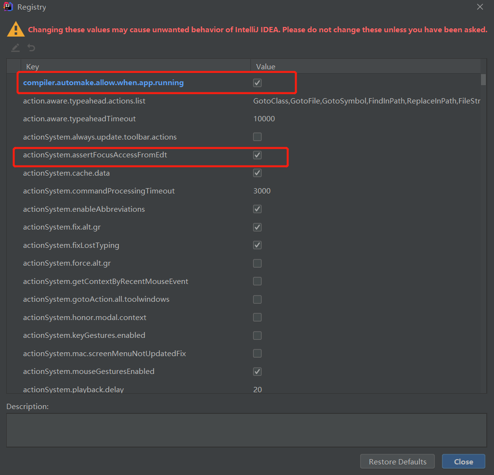

# Spring-Cloud学习笔记

### 1、版本选择

springcloud和springboot的版本根据官方文档选择https://spring.io/

springCloud: 2021.0.3

springBoot: 2.7.3

Mysql: 8.0.30

### 2、创建pom父工程引入依赖

```xml
<?xml version="1.0" encoding="UTF-8"?>
<project xmlns="http://maven.apache.org/POM/4.0.0"
         xmlns:xsi="http://www.w3.org/2001/XMLSchema-instance"
         xsi:schemaLocation="http://maven.apache.org/POM/4.0.0 http://maven.apache.org/xsd/maven-4.0.0.xsd">
    <modelVersion>4.0.0</modelVersion>

    <groupId>com.study</groupId>
    <artifactId>spring-cloud-study01</artifactId>
    <version>1.0-SNAPSHOT</version>
    <packaging>pom</packaging>

    <modules>
        <module>cloud-provider-payment8001</module>
    </modules>

    <properties>
        <maven.compiler.source>8</maven.compiler.source>
        <maven.compiler.target>8</maven.compiler.target>
        <springCloud.version>2021.0.3</springCloud.version>
        <springBoot.version>2.7.3</springBoot.version>
        <mybatis.version>3.5.1</mybatis.version>
        <alibaba.version>2021.0.1.0</alibaba.version>
        <druid.version>1.2.11</druid.version>

        <lombok.version>1.18.24</lombok.version>
    </properties>

    <dependencyManagement>
        <dependencies>
            <!--springCloud,springBoot,springBootStart,springCloudAlibaba等主要依赖包引入-->
            <dependency>
                <groupId>org.springframework.cloud</groupId>
                <artifactId>spring-cloud-dependencies</artifactId>
                <version>${springCloud.version}</version>
                <type>pom</type>
                <scope>import</scope>
            </dependency>

            <dependency>
                <groupId>org.springframework.boot</groupId>
                <artifactId>spring-boot-dependencies</artifactId>
                <version>${springBoot.version}</version>
                <type>pom</type>
                <scope>import</scope>
            </dependency>

            <dependency>
                <groupId>com.alibaba.cloud</groupId>
                <artifactId>spring-cloud-alibaba-dependencies</artifactId>
                <version>${alibaba.version}</version>
                <type>pom</type>
                <scope>import</scope>
            </dependency>

            <dependency>
                <groupId>com.alibaba</groupId>
                <artifactId>druid-spring-boot-starter</artifactId>
                <version>${druid.version}</version>
            </dependency>

            <dependency>
                <groupId>com.baomidou</groupId>
                <artifactId>mybatis-plus-boot-starter</artifactId>
                <version>${mybatis.version}</version>
            </dependency>

            <!--一些工具依赖包引入-->
            <dependency>
                <groupId>org.projectlombok</groupId>
                <artifactId>lombok</artifactId>
                <version>${lombok.version}</version>
                <scope>provided</scope>
            </dependency>
        </dependencies>
    </dependencyManagement>

    <build>
        <plugins>
            <!--把项目所有依赖的jar包同时打包进来，形成可以直接运行的独立jar包，热部署插件-->
            <plugin>
                <groupId>org.springframework.boot</groupId>
                <artifactId>spring-boot-maven-plugin</artifactId>
                <configuration>
                    <fork>true</fork>
                    <addResources>true</addResources>
                </configuration>
            </plugin>
        </plugins>
    </build>

</project>
```

### 3、创建子模块支付模块

##### 模块创建遵循规则

###### 1、创建module

​	idea => 项目目录右键 =>new => module => 选择Maven工程，创建空工程就可以了

###### 2、改POM

​	修改子模块里面的pom文件，加入相关的依赖。这个根据具体情况具体加

下面是springboot要用到的一些依赖，一般情况下从父工程复制过来就行

```xml
<?xml version="1.0" encoding="UTF-8"?>
<project xmlns="http://maven.apache.org/POM/4.0.0"
         xmlns:xsi="http://www.w3.org/2001/XMLSchema-instance"
         xsi:schemaLocation="http://maven.apache.org/POM/4.0.0 http://maven.apache.org/xsd/maven-4.0.0.xsd">
    <parent>
        <artifactId>spring-cloud-study01</artifactId>
        <groupId>com.study</groupId>
        <version>1.0-SNAPSHOT</version>
    </parent>
    <modelVersion>4.0.0</modelVersion>

    <artifactId>cloud-provider-payment8001</artifactId>

    <properties>
        <maven.compiler.source>8</maven.compiler.source>
        <maven.compiler.target>8</maven.compiler.target>
    </properties>

    <dependencies>
        <dependency>
            <groupId>org.springframework.boot</groupId>
            <artifactId>spring-boot-starter</artifactId>
        </dependency>

        <dependency>
            <groupId>org.springframework.boot</groupId>
            <artifactId>spring-boot-starter-web</artifactId>
        </dependency>

        <dependency>
            <groupId>org.springframework.boot</groupId>
            <artifactId>spring-boot-starter-actuator</artifactId>
        </dependency>

        <dependency>
            <groupId>mysql</groupId>
            <artifactId>mysql-connector-java</artifactId>
        </dependency>

        <dependency>
            <groupId>com.alibaba</groupId>
            <artifactId>druid-spring-boot-starter</artifactId>
        </dependency>

        <dependency>
            <groupId>com.baomidou</groupId>
            <artifactId>mybatis-plus-boot-starter</artifactId>
        </dependency>

        <dependency>
            <groupId>org.projectlombok</groupId>
            <artifactId>lombok</artifactId>
            <scope>provided</scope>
        </dependency>

        <dependency>
            <groupId>org.springframework.boot</groupId>
            <artifactId>spring-boot-starter-test</artifactId>
            <scope>test</scope>
        </dependency>

        <!--热部署-->
        <dependency>
            <groupId>org.springframework.boot</groupId>
            <artifactId>spring-boot-devtools</artifactId>
            <scope>runtime</scope>
            <optional>true</optional>
        </dependency>
    </dependencies>

</project>
```

###### 3、写YML

编写配置文件，文件后缀有两种.yml,.properties。创建哪种配置文件看自己心情

更多配置自行根据具体情况去百度

```yaml
server:
  port: 8001

spring:
  application:
    name: cloud-provider-payment
  datasource:
    type: com.alibaba.druid.pool.DruidDataSource
    driver-class-name: com.mysql.cj.jdbc.Driver
    url: jdbc:mysql://localhost:3306/mybatis?useUnicode=true&characterEncoding=utf-8&useSSL=false
    username: root
    password: li252969957

mybatis-plus:
  configuration:
    log-impl: org.apache.ibatis.logging.stdout.StdOutImpl
  type-aliases-package: com.study.cloud.pojo
```

###### 4、主启动

创建主启动类

```java
package com.study.cloud;

import org.springframework.boot.SpringApplication;
import org.springframework.boot.autoconfigure.SpringBootApplication;

@SpringBootApplication
public class PaymentApplication8001 {
    public static void main(String[] args) {
        SpringApplication.run(PaymentApplication8001.class, args);
    }
}
```

###### 5、业务类

建表，创建业务类文件包，包名看各自的规范

业务类文件包括 pojo(实体类)   servie(服务类)  mapper(mapper类)  controller(控制类)  大体是这几个类了当然resource下还建个mapper文件



### 4、热部署

看上面第2步父工程插件依赖，第3步2小步热部署依赖

idea**需要开启的配置**



按快捷 **Alt+Ctrl+Shift+/**  出现弹框选择Registry






### 5、建立消费模块，使用restTemplate

每次建立新的模块和第3步骤一样，也就是pom的引入，yml文件的配置，业务类根据模块功能的不同引入的类容不同

```java
/**restTemplate简单配置**/
@Configuration
public class ApplicationContextConfig {

    @Bean
    public RestTemplate getResetTemplate() {
        return new RestTemplate();
    }
}

```

```java
/** restTemplate的简单使用**/

@RestController
@Slf4j
public class OrderController {
    public static final String PAYMENT_URL = "http://localhost:8001";

    @Resource
    private RestTemplate restTemplate;

    @PostMapping("/consumer/order/create")
    public CommonResult createOrder(Payment payment) {
        CommonResult commonResult = restTemplate.postForObject(PAYMENT_URL + "/payment/insert", payment, CommonResult.class);
        return commonResult;
    }

    @GetMapping("/consumer/getOrder/{id}")
    public CommonResult getOrderById(@PathVariable("id") Long id) {
        CommonResult template = restTemplate.getForObject(PAYMENT_URL + "/payment/getOne/" + id, CommonResult.class);
        return template;
    }
}
```

### 6、工程重构

公共模块抽取出来放到统一的module，建立方式和第3步骤相同。可以去掉主启动，公共模块不需要启动。其他的看公共模块的复杂程度

其他的模块需要使用公共模块时，要自行在pom里面引入。

```xml
<dependency>
    <groupId>com.study</groupId>
    <artifactId>cloud-api-common</artifactId>
    <version>${project.version}</version>
</dependency>
```

### 7、其它笔记参考

https://blog.csdn.net/u011863024/article/details/114298270


